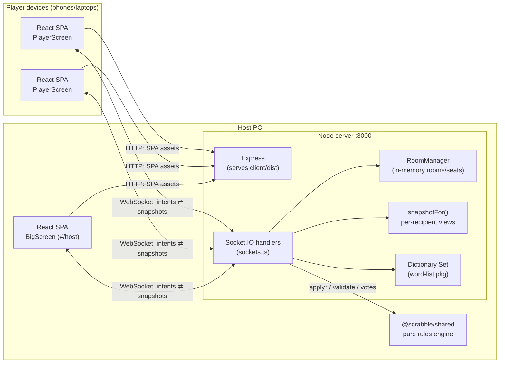

# 🎉 Scrabble Party

Browser Scrabble for 2–8 players on your Wi-Fi — one PC runs the server, everyone else joins from their phone.

## Overview

Scrabble Party is built for a living-room party: a laptop/PC on the local network
runs the game server and doubles as a "big screen" showing the board, scores, and a
QR code; players join from any phone or laptop browser by scanning the code. There
is no internet dependency, no accounts, and no database — a game lives entirely in
the server's memory and dies with the process.

It keeps original Scrabble rules but adds **leniency options** chosen by the host:
play without a dictionary (with player challenges settled by group vote), or with a
dictionary whose rejections the group can vote to override; optional take-backs; and
optional free tile swaps. Games of 5–8 players use a doubled (200-tile) bag.

## Architecture



Three npm workspaces with a strict dependency direction (`client`/`server` → `shared`; never between `client` and `server`):

| Package | Responsibility |
|---|---|
| `@scrabble/shared` | The rules engine, pure TypeScript with no I/O: board layout and premium squares, tile bag, placement validation, scoring, turn/state transitions (`applyPlay`/`applySwap`/`applyPass`/`applyTakeBack`), challenge & override voting, the `GameMode` extension point, and the socket wire contract (`events.ts`). |
| `@scrabble/server` | The single authoritative process. Express serves the built client; Socket.IO handlers authenticate intents (seat token / host token), call the engine, consult the dictionary, and broadcast per-recipient snapshots. `RoomManager` keeps rooms, seats, and reconnect tokens in memory. |
| `@scrabble/client` | Mobile-first React SPA. A single Zustand store owns the socket and the latest snapshot; hash routes render the join flow, lobby, player screen, host setup, and big screen. |

**The server is authoritative.** Clients never compute game state; they send intents
and render whatever snapshot comes back. All rule logic lives in `shared`, so the
server can't drift from the engine and the engine is unit-testable in isolation.

## Control flow

A move, end to end:

```mermaid
sequenceDiagram
    participant P as Player phone (SPA)
    participant S as Server (sockets.ts)
    participant E as Engine (@scrabble/shared)
    P->>S: move:play { code, token, placements } (ack callback)
    S->>S: auth(): token → seat, room.game exists?
    S->>E: mode.play(state, playerId, placements)  — full dry-run
    E-->>S: { ok, state' } | { ok:false, reason }
    alt invalid (turn / rack / geometry / blanks)
        S-->>P: ack { ok:false, error }
    else dictionary mode & word not in dict
        S->>E: startOverrideVote(state, …)
        S-->>P: ack { ok:true }
        S->>S: broadcast voting-phase snapshots
        Note over P,S: players emit vote:cast; majority (tie → allow) resolves
    else valid
        S->>S: room.game = state'
        S-->>P: ack { ok:true }
        S->>S: broadcast() new snapshots to every seat + watch room
    end
```

- Every client→server event carries the room code plus a credential (`token` for a
  seat, `hostToken` for host actions like `game:start` and `host:skip`) and gets a
  typed ack `{ok, error?}`.
- Every state change ends in `broadcast()`: each connected seat gets its own
  `snapshotFor(room, playerId)` and the watch room (big screen/spectators) gets
  `snapshotFor(room, null)`.
- Challenges (`challenge:start`) and dictionary overrides move the game to phase
  `'voting'`; `vote:cast` resolves once all eligible voters vote (majority, tie goes
  to the mover). The host can force-resolve a stalled vote or skip an absent
  player's turn with `host:skip`.
- Reconnects: players hold `scrabble-seat` in localStorage and re-emit
  `room:reconnect` on every socket connect; the big screen holds `scrabble-host`
  and re-emits `room:watch` (only on the `#/host` route).

## Data flow

All state lives in one place — `RoomManager`'s `Map<code, Room>` on the server:

```
Room { code, hostToken, seats: Seat[], settings, modeId, game: GameState | null }
Seat { playerId, token, name, avatar, socketId | null }        // socketId = presence
GameState { board: Cell[][], bag: Tile[], players[{rack, score, …}],
            currentPlayerIndex, phase: lobby|playing|voting|ended,
            consecutivePasses, lastMove, pendingVote, winnerIds }
```

- Engine functions are pure: state in → `{ok:true, state:next}` out, no mutation.
  The server swaps `room.game` only on success.
- Clients never see `GameState`. They see `ClientSnapshot`
  (`packages/shared/src/events.ts`), computed per recipient by
  `packages/server/src/snapshot.ts`: your own `rack` is populated, everyone else is
  a `rackCount`; the bag is only a `bagCount`; `lastMove.drawnTileIds` is stripped
  for everyone (tile IDs are assigned pre-shuffle, so leaking IDs would leak
  letters). Spectators get no racks at all.
- The client store (`packages/client/src/store.ts`) holds exactly one snapshot and
  re-renders from it; there is no client-side game model to reconcile.
- Nothing is persisted to disk. Stopping the server ends all games.

## Prerequisites

- **Node.js 20+** (developed on Node 24; the server uses ESM + top-level await) and npm.
- A Wi-Fi network where devices can reach each other (guest networks often isolate
  clients — see Troubleshooting).
- No accounts, API keys, or environment variables. The port is fixed at `3000`
  (`packages/server/src/main.ts`).

## Installation

```bash
git clone <repo-url> scrabble && cd scrabble
npm install        # installs all three workspaces
npm run build      # shared → client → server (client/dist is what the server serves)
npm test           # optional sanity check: 66 tests across shared + server
```

There is no `.env`; configuration is the host's in-game choices (leniency options)
made on the host setup screen.

## Usage

```bash
npm start
```

The terminal prints the LAN URL (e.g. `http://192.168.1.20:3000`) and a QR code.

1. On the PC (the "big screen"): open `http://localhost:3000/#/host`, pick your
   house rules, and open the room.
2. Players: scan the QR on the big screen (or type the URL and the 4-letter room
   code — codes never contain I or O).
3. Hit **Start the game!** with 2+ players.

### House rules (leniency options)

- **Word checking:** anything goes (with challenges + group vote), or dictionary
  with group override vote.
- **Take-backs:** undo your own move before the next player acts.
- **Free swaps:** off / N per player / unlimited.

### In-game notes

- Phones that lock/sleep reconnect automatically with the same rack (💤 shows while away).
- The host's big screen has **Skip turn** / **Close vote** buttons to unstick a game
  when a player disappears mid-turn or mid-vote.
- 5–8 players draw from a doubled 200-tile bag; 2–4 players use the standard 100.

## Development

```bash
npm run dev -w packages/server    # tsx watch, API + sockets on :3000
npm run dev -w packages/client    # Vite dev server (HMR), proxies /socket.io to :3000
npm run lint -w packages/client   # oxlint
```

Open the Vite dev URL for the client; the proxy forwards socket traffic to the
server. `npm run build` also acts as the typecheck (`tsc` in every package; the
server's build is `--noEmit` since it runs from source via `tsx`).

## Testing

```bash
npm test                            # shared (50 tests) + server (16 tests)
npm test -w packages/shared         # rules engine only
npm test -w packages/server         # server only (real-socket integration tests)
npm test -w packages/shared -- engine                      # one file
npx vitest run -t "take-back" --root packages/shared       # one test by name
```

- **Shared**: pure unit tests for board, tiles, placement, scoring, engine
  transitions, and vote resolution.
- **Server**: integration tests that boot the real Socket.IO server on an ephemeral
  port and drive it with real clients (join, reconnect, moves, challenges,
  override votes, host skip, snapshot privacy).
- **Client**: no test suite; it is gated by strict TypeScript (`tsc -b`) and the
  Vite build. Keep `"strict": true` in `packages/client/tsconfig.app.json` — the
  client type-checks the shared *sources*, and shared code fails to compile without it.

There is no coverage threshold configured. Convention: engine/rules changes get a
shared unit test; socket-handler changes get a server integration test.

## Deployment

There is deliberately no deployment: the "production" environment is a PC on the
party's Wi-Fi running `npm run build && npm start`. The server binds `0.0.0.0:3000`
and serves the built SPA and websockets from the one process. There is no CI
configured (run `npm run build && npm test` before merging).

## Remote access (beyond the LAN)

The app is LAN-only by design, but for a one-off test with remote friends you can
tunnel the local server to a public HTTPS URL without deploying anywhere or changing
any code — the server already binds `0.0.0.0` and the client connects relative to
`window.location`, so it works behind any HTTPS/WebSocket tunnel as-is.

⚠️ **The app has no auth beyond room codes.** Anyone with the tunnel URL can join or
host a room. Fine for a short test with people you trust; don't leave a tunnel
running unattended. Also, the QR code on the big screen always encodes the **LAN**
address — remote players need the tunnel URL typed in directly, not the QR scan.

Two options, depending on whether you want a throwaway URL or a stable one you'll
reuse for repeat game nights:

|  | Cloudflare Quick Tunnel | Tailscale Funnel |
|---|---|---|
| Account needed | No | Yes (free) |
| URL | Random, changes every run | Stable, same URL every time |
| Best for | One-off test tonight | Recurring games with the same group |

### Option A — Cloudflare Quick Tunnel (no account, throwaway URL)

1. Install the `cloudflared` binary once:
   ```bash
   winget install Cloudflare.cloudflared
   ```
   (or download `cloudflared-windows-amd64.exe` from the
   [cloudflared releases page](https://github.com/cloudflare/cloudflared/releases)).
2. Start the game server as usual:
   ```bash
   npm run build && npm start
   ```
3. In a second terminal, open the tunnel:
   ```bash
   cloudflared tunnel --url http://localhost:3000
   ```
4. Cloudflare prints a URL like `https://random-words-here.trycloudflare.com`.
   Share that with remote players — HTTPS and WebSockets work out of the box, no
   account, no visitor warning page, no time limit.
5. Stop the tunnel with `Ctrl+C`. The URL is gone for good; the next run gets a new
   random one.

Want the URL to stay the same across runs instead? That needs a free Cloudflare
account and a domain you own: `cloudflared tunnel login`, then
`cloudflared tunnel create scrabble`, map `scrabble.yourdomain.com` to it in the
tunnel config, and run with `cloudflared tunnel run scrabble`.

### Option B — Tailscale Funnel (stable URL, best for recurring game nights)

1. Install Tailscale and sign in (Google/GitHub/Microsoft all work):
   ```bash
   winget install Tailscale.Tailscale
   ```
2. One-time setup in the [Tailscale admin console](https://login.tailscale.com/admin/dns):
   enable **MagicDNS** and **HTTPS Certificates** for your tailnet. The first time you
   run Funnel it'll also prompt you to approve it via a link.
3. Start the game server as usual:
   ```bash
   npm run build && npm start
   ```
4. In a second terminal, turn on Funnel for port 3000:
   ```bash
   tailscale funnel 3000
   ```
5. You get a stable URL like `https://your-pc.tailXXXX.ts.net` — it's the same every
   time you run this. Share it with remote players; they need **no Tailscale install**
   on their end, since Funnel makes it public.
6. Stop with `Ctrl+C`, or run it detached with `tailscale funnel --bg 3000` and tear
   it down later with `tailscale funnel reset`.

**Prefer not to expose anything publicly?** If everyone playing already has (or
installs) Tailscale and joins your tailnet, skip Funnel entirely — they can browse
straight to `http://your-pc:3000` over the private Tailscale VPN, and nothing is
reachable from the open internet.

### Verifying a tunnel actually works

1. Open the public URL on a phone with **Wi-Fi off** (mobile data only) — this
   proves it's genuinely internet-reachable, not just LAN.
2. Host a room on one device, join from the phone using the room code, and play a
   turn — this exercises the full Socket.IO path end-to-end.
3. In the phone browser's devtools Network tab, confirm the `socket.io` connection
   upgrades to `websocket` (it'll also work over polling, just laggier).

## Project structure

```
package.json                 # npm-workspaces root; build/test/start orchestration
tsconfig.base.json           # shared strict compiler options
docs/superpowers/            # design spec + original implementation plan
packages/
  shared/src/
    types.ts                 # Tile, Board, PlayerState, GameState, settings, votes
    board.ts                 # 15×15 board + premium squares
    tiles.ts                 # letter values, bag creation (×2 at 5+ players), drawing
    placement.ts             # geometric move validation (line, contiguity, anchoring)
    scoring.ts               # word finding + premium scoring + bingo
    engine.ts                # applyPlay/Swap/Pass/TakeBack, finalizeGame, endgame
    votes.ts                 # challenge + override votes, host force-resolution
    modes.ts                 # GameMode interface; ClassicMode; MODES registry
    events.ts                # socket wire contract: events + ClientSnapshot
  server/src/
    main.ts                  # entry: express static + socket.io + LAN URL/QR banner
    rooms.ts                 # RoomManager: codes, seats, tokens (all in memory)
    sockets.ts               # every socket handler; auth; broadcast()
    snapshot.ts              # per-recipient ClientSnapshot (privacy boundary)
    dictionary.ts            # loads the word-list package into a Set
  client/src/
    store.ts                 # Zustand store: socket lifecycle, intents, reconnect keys
    App.tsx                  # hash routing: #/ join flow, #/host big screen
    screens/                 # JoinScreen, Lobby, PlayerScreen, HostSetup, BigScreen
    components/              # BoardView, Rack, VoteSheet, GameOver, AvatarPicker
    theme.css                # cartoonish theme custom properties
```

## Troubleshooting / FAQ

**Phones can't reach the PC.**
First launch: when Windows asks, allow Node.js on **Private networks**. If you
missed the prompt, open **Windows Defender Firewall → Allow an app through
firewall**, find Node.js, and tick **Private**. Also confirm both devices are on
the *same* SSID — guest networks often isolate clients from each other.

**The page loads but shows nothing / `npm start` serves a 404.**
The server serves `packages/client/dist` — run `npm run build` first.

**The terminal shows `127.0.0.1` instead of a LAN address.**
The server picked the first non-internal IPv4 interface and found none — check that
the PC is actually connected to the Wi-Fi/LAN.

**A player vanished and it's their turn / a vote is stuck.**
The host's big screen has **Skip turn** (force-pass) and **Close vote** (resolve
counting only connected voters) buttons.

**Room code rejected.**
Codes are 4 letters and never contain I or O (to avoid confusion with 1/0).

### Manual verification checklist

Automated so far: full build + 66 tests, plus a browser-driven smoke test (room
created from `#/host`, two players joined, game started, board/racks/bag rendered).
Still worth checking with real hardware before a party:

- [ ] 3+ real devices (PC + 2 phones) completing a full game to the end screen.
- [ ] Scanning the QR code with a phone camera (vs. typing the URL).
- [ ] A 5-player game draws from the full 200-tile bag as expected.
- [ ] A challenge vote retracts a word and scores revert on every screen.
- [ ] A dictionary-override game rejects gibberish, then a vote allows it anyway.
- [ ] Take-back restores rack and turn, and is disabled when the host turned it off.
- [ ] Phone screen-lock + unlock reconnects with the same rack (💤 shows while away).
- [ ] The board is playable one-handed on a ~375px-wide phone (scroll + tap-to-place).
- [ ] The Windows Defender firewall prompt appears on first `npm start` and
      "Private networks" is sufficient.

## Contributing

No CONTRIBUTING.md yet. In short: conventional-commit messages with package scopes
(`feat(server): …`, `fix(shared): …`), tests for engine and socket changes, and
`npm run build && npm test` clean before merging. See `CLAUDE.md` for the
architectural guardrails (authoritative server, rules only in `shared`, snapshot
privacy).

## License

No license file is present. <!-- TODO: pick a license (e.g. MIT) if this is ever published. -->
